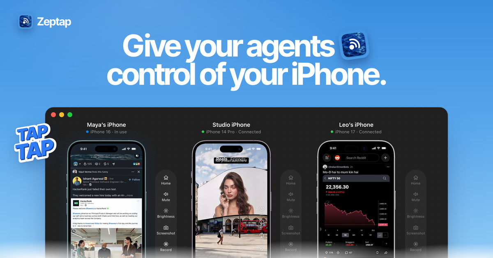
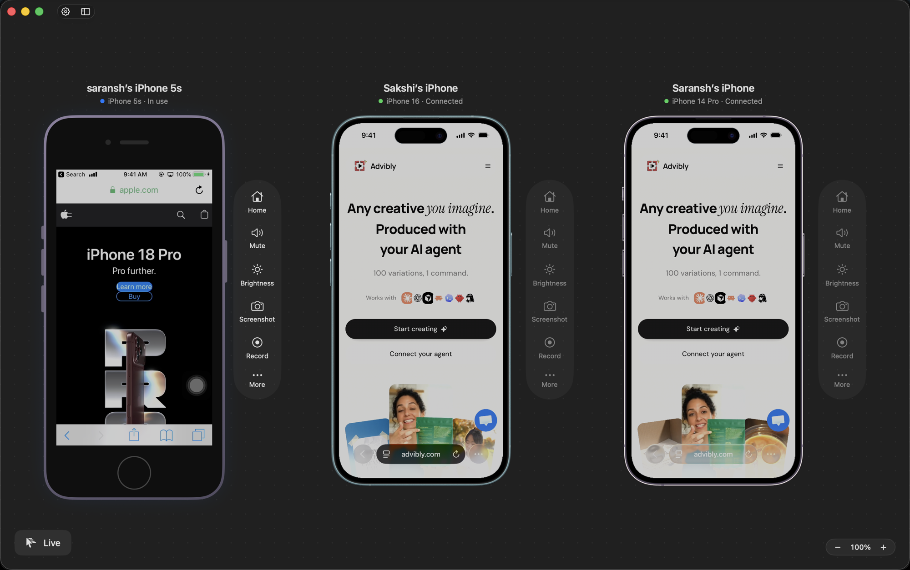

  

  <b>Let your AI agents use your real iPhone just like you do.</b> 
  Open apps, read the screen, tap, swipe and type, from a Mac app.

  
  &nbsp;
  
  &nbsp;
  

  
  
  

---

  

## What it is

Zeptap is a Mac app that puts your iPhone's screen on your Mac and lets you, or any AI agent, drive it. Your agent sees the screen, then taps, swipes and types on it through a local [MCP](https://modelcontextprotocol.io) server. Every step comes back with a screenshot, so you can watch exactly what it does.

It's your real, physical iPhone with your apps and accounts, not a simulator. If you can do it on your iPhone, your agents can too.

> "check my screen time" · "turn on dark mode" · "find the wifi password" · "rsvp yes to the party" · "book the 7am spin class" · "what did jay text me"

## Why Zeptap

**🔌 No Xcode. No developer mode. Just plug it in.**
Other ways of letting software drive a real iPhone start with a developer setup. Zeptap starts with a cable. Developer Mode stays off, nothing gets installed or signed on the phone, nothing expires after 7 days, and you don't need a $99/yr Apple developer account.

**🤖 Works with the agent you already use.**
Connect Claude Code, Claude Desktop, Codex, Cursor, Hermes or OpenClaw in one click. Anything else that speaks MCP can connect to `http://127.0.0.1:47801/mcp`.

**💬 Built-in chat. Bring your own AI. No credits to buy.**
Press <kbd>⌘</kbd><kbd>L</kbd> to chat with your phone. The chat signs in to the Claude Code or Codex you already use, so it runs on your Claude or ChatGPT plan. Would you rather pick the model? Add an OpenRouter key. Zeptap adds no AI credits, subscription or token markup.

**🔒 Nothing leaves your Mac.**
No account and no Zeptap cloud. The screen is captured and read on your Mac, and the MCP server only accepts connections from that Mac. Screenshots go only to the agent you connect.

**🔑 It unlocks your phone, but only if you say so.**
Your passcode is stored in the macOS Keychain on that Mac only, never in iCloud, and agents never see it. Each unlock makes a single attempt, so a wrong passcode can't lock you out, and you can switch unlocking off for each phone.

**📱 One iPhone or a whole desk of them.**
Run several iPhones side by side in one window, each with Home, Mute, Brightness, Screenshot and Record controls.

## How it works

Your Mac sees the iPhone's screen over the USB cable. It taps, swipes and types as a Bluetooth keyboard and pointer, through AssistiveTouch, which Zeptap turns on for you. Agents drive all of this through the MCP server running on your Mac.

## Get started

1. **[Download Zeptap](https://github.com/zeptap/releases/releases/latest/download/Zeptap.dmg)**, open the DMG and drag Zeptap to Applications.
2. **Connect your iPhone** with a USB cable. Setup walks you through it. The only step on the phone is Bluetooth pairing.
3. **Give it a task** in the built-in chat (<kbd>⌘</kbd><kbd>L</kbd>), or connect your own agent.

**You need:** a Mac on macOS 14 or later with Bluetooth, an iPhone, and a USB cable. First, quit any other app that acts as a Bluetooth keyboard for the iPhone, because only one app can hold that connection.

**Updates:** Zeptap updates itself. New versions show up as an **Update** button in the app, or you can check any time from **Zeptap › Check for Updates…**

## Pricing

Your first hour of live use is free with everything unlocked, and setup and pairing don't count toward it. After that, choose a monthly or lifetime license, or Lifetime Plus to run up to 5 iPhones at once. There's no account: you get a license key by email and click Activate. See **[zeptap.com/pricing](https://zeptap.com/pricing)**.

## FAQ

<b>Is this an iOS Simulator?</b>

No. Simulators run a virtual copy of iOS that can't install App Store apps or use your accounts. Zeptap drives your real, physical iPhone.

<b>What can it use?</b>

Anything on your iPhone: App Store apps, Messages, Settings, Safari, Photos. If you can tap it, your agent can.

<b>Do I need to install anything on my iPhone?</b>

No. The only step on the phone is pairing it with your Mac over Bluetooth. Zeptap turns on AssistiveTouch for you over USB.

<b>Do I pay for the AI model too?</b>

Zeptap doesn't include a model. It works with the agent you already use on your own plan with that provider, so you don't pay twice.

<b>Where does my data go?</b>

Zeptap has no account and no cloud. The screen is captured and read on your Mac. Screenshots go to the agent you connect, and from there to its model provider.

## About this repo

This repo only hosts Zeptap's release builds. You'll find every version under **[Releases](https://github.com/zeptap/releases/releases)**. The download link above always points to the newest one.

Questions or problems? Email **[support@zeptap.com](mailto:support@zeptap.com)** or read the **[docs](https://zeptap.com/docs)**.

Made by <a href="https://zeptap.com">Afterlume Labs</a>

